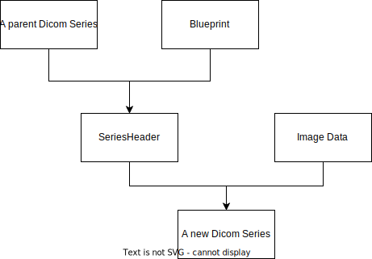

## Introduction

It can be just as much of a headache going back to dicom image format, this tutorial showcases the library tools for creating new dicom series.

For this you need a header and a specialized factory, both base classes can be found in `dicomnode.lib.dicom_factory`.

Building a new dicom series happens in three steps.

1. A `Blueprint` and Specialized `DicomFactory` is given to an AbstractPipeline
2. A parent dicom Series and a `Blueprint` produce a `SeriesHeader`
3. A `SeriesHeader` and an image produces the new Dicom Series.

With the data flow seen can be seen below:



## Definitions

* `Blueprint` - A static blueprint for a dicom series
* `A parent dicom series` - A dicom series, which we want to create a derived series from.
* `SeriesHeader` - A header for an image, without the image.
* `Image Data` - Data of some kind, without a dicom header
* `A new dicom series` - The series you want to create.

All of the actual building is done by a  `DicomFactory`. You need to specialize this factory to handle different types image data.

For instance the `NumpyFactory` converts images represented by a numpy array back to dicom series.

## Building a Blueprint

A blueprint is a collection of tags and some methodology associated with said tag. Which this library represent as a virtual element also found in `dicomnode.lib.dicom_factory`.

### Virtual Elements

By default a virtual element is shared among the entire series, like Patient Name and other such attributes.

The library provides the following build in virtual elements:

* AttributeElement - This reads an attribute from the dicom factory
* CopyElement - This reads an value from a dataset in the parent series and copies it to all elements in the new series.
* DiscardElement - This ensures that an element from the parent series is not present in the new Series.
* SeriesElement - An element which evaluates a function and shares that value with all images in the new series.
* StaticElement - An element with a predefined value.

### Instanced Virtual Elements

Some tags are not shared in the series like SOPInstanceUID or ImagePositionPatient, and for these tags the library provides the following `InstanceVirtualElements`:

* `FunctionalElement` - A function is evaluated
* `InstanceCopyElement` - Each value from the parent series is and passed into the new series by InstanceNumber. This element requires that you produce fewer images than the parent series contains as otherwise there would be no value to copy.

Each of the `InstanceVirtualElements` are evaluated using a `InstanceVirtualEnvironment` which contains most information the `InstanceVirtualElements` needs to produce a dicom DataElement.


### An Example and Blueprint arithmetic

As an example you can see a simple blueprint, which copies the patient name and sets the series description to "Blueprint Example"

```python
from dicomnode.lib.dicom_factory import Blueprint, CopyElement, StaticElement

my_blueprint = Blueprint([
  StaticElement(0x0008103E, 'LO', "Blueprint Example"),
  CopyElement(0x00100010),
])
```

Now a dicom image can easily contain hundreds of tags, so the library contains some pre-build blueprints that concatenate into a bigger blueprint, for instance if you need to add the SOP common module in the new series.

```python
from dicomnode.lib.dicom_factory import SOP_common_blueprint

new_blueprint = my_blueprint + SOP_common_blueprint
```

Note that unlike the regular `+` this is not an commutative operation. I.E for some blueprints: `blueprint_1 + blueprint_2 != blueprint_2 + blueprint_1`

Namely this occur when both blueprint contain the same tag, at which point the second arguments tags are dominant.

You can also overwrite tags like a dictionary

```python
from pydicom.uid import SecondaryCaptureImageStorage

new_blueprint = StaticElement(0x00080016, 'UI', SecondaryCaptureImageStorage)
```

Ultimately the build-in blueprints are default values and may not be right for your project. Use them as baselines and overwrite them.

### Filling Strategy

A question arises about what to do with tags in the parent series that is not in `Blueprint`, here the `DicomFactory` relies on it's filling strategy, which is just an enum, providing the desired execution path.

The options are:

* `Discard` - The unknown tag is discarded in the new series
* `Copy` - A representative or pivot is randomly selected from the parent series and copied to the new series

## Building Series in a pipeline

To implement this in a dicomnode you need to overwrite some tags in the `AbstractPipeline` similar to how is done in [create a pipeline](./create_a_pipeline.md).

You need to fill the attributes:

* `dicom_factory: Optional[DicomFactory]` - This is the factory, that is used to create the series header. Note that this object is shared with all threads.
* `header_blueprint: Optional[Blueprint]` - Blueprint to construct series header from.

Futhermore there's two Optional Attributes.

* `filling_strategy: FillingStrategy` - FillingStrategy to be used in `SeriesHeader` Creation, defaults to `Discard`
* `parent_input: Optional[Str]` - Specifies the input to be used as parent, must equal a key in the `input` attribute. If unspecified a random input series is used.

If you have filled these attributes a `SeriesHeader` will be produced and become the `header` attribute of the `InputContainer` in the process function

### Example


```python
from dicomnode.lib.dicom_factory import Blueprint, DicomFactory, SeriesHeader ...
from dicomnode.server.nodes import AbstractPipeline

class MyFactory(DicomFactory):
  def build_from_header(series_header: SeriesHeader, image: Any) -> List[Dataset]
  ...

blueprint = Blueprint([
  ...
])

class MyPipeline(AbstractPipeline):
  ...
  dicom_factory = MyFactory()
  header_blueprint = blueprint

  def process(self, input_container)
    image = ...

    datasets = self.dicom_factory.build_from_header(input_container.header, image)
```

Note that it's unlikely that you need to impliement your own DicomFactory, as there's a few build into the library:

* NumpyFactory - numpy arrays
* NiftiFactory - nifti images
